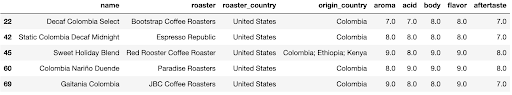
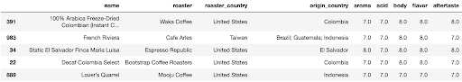
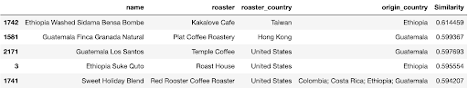

# Coffee Bean Recommender

## Executive Summary
This project is to provide an solution to coffee enthusiasts that buy specialty coffee bean fresh from local roasters. As this hobby is gaining popularity, there is also an increase in coffee roasters locally. This recommender system will aim to propose coffee bean based on certain features: Tasting notes, taste ranking scores and origin of coffee bean.

Using dataset from [Kaggle](https://www.kaggle.com/datasets/hanifalirsyad/coffee-scrap-coffeereview)

This dataset is use to help set the base feature for this recommender. Thereafter, any new locally scrap data can be build upon this. The systems uses content-based filtering using similarity score for tasing notes, nearest neighbour for taste ranking score and matching string value to country origin.

## How it works
The recommender system uses content-based filtering to recommend coffee beans to users. Content-based filtering is a technique that recommends items similar to the ones that a user input. User can input coffee bean origin(optional), taste rating score and tasting notes (words).

The system first filter out coffee bean origin from user input (if input is none, then there will be no filtering on origin column). 
 Example: Origin= 'Colombia'
 

Secondly, it will take in taste rating score input and run through nearest neighbour with n_neighbour = 50.
 Example: Aroma = 6, Acidity = 7, Body = 8, Flavor = 7, After Taste = 9
 

Lastly, it will take in user string input of tasting notes and fit through Spacy trained pipeline(en_core_web_lg). Then it sort by the highest similarity score to the coffee description.
 Example: "Juicy, Sweet, Bright"
 

You can try out the app [here](https://beans4u.streamlit.app/)
